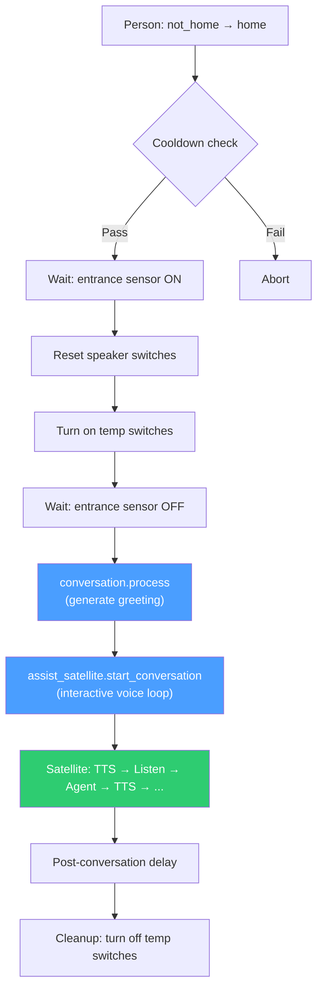
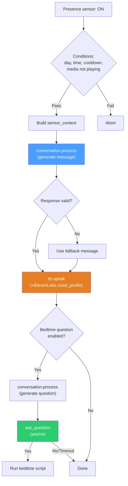

# Voice Assistant Blueprint Pattern — End-to-End Reference

> **Scope:** This document covers the complete voice assistant architecture as implemented in this Home Assistant instance — from the moment someone says a wake word to the moment TTS audio comes out of a speaker. Every layer, every handoff, every damn gotcha.
>
> **Terminology:** All YAML examples use `action:` (current HA syntax, standardized since 2024.x). The older `service:` key still works as an alias but should not be used in new code. If you see `service:` in existing configs, migrate to `action:` when editing.

---

## Table of Contents

1. [Architecture Overview](#architecture-overview)
2. [Layer 1: ESPHome Voice PE Satellites](#layer-1-esphome-voice-pe-satellites)
   - Device Configs
   - Config Structure
   - Key Principles (Dual Wake Word, VAD, Dynamic Model Control)
   - Current Config Issues to Note
3. [Layer 2: HA Voice Pipeline](#layer-2-ha-voice-pipeline)
   - Pipeline-to-Satellite Mapping
4. [Layer 3: Conversation Agents](#layer-3-conversation-agents)
   - Integration Landscape Note (Extended vs Native OpenAI)
   - Agent Naming Convention (§8.4)
   - Mandatory Prompt Sections (§8.3)
   - Separation of Concerns — The Golden Rule (§1.2, §8.2)
   - Tool Exposure (§8.3.2)
   - MCP Servers as Tool Sources (HA 2025.2+)
5. [Layer 3.5: Pyscript Orchestration](#layer-35-pyscript-orchestration)
   - Dispatcher, Handoff, Whisper Network
   - Memory (L1/L2/L3)
   - TTS Queue Manager
6. [Layer 4: Blueprints (Orchestration)](#layer-4-blueprints-orchestration)
   - Blueprint Categories in This Setup
   - The Coming Home Pattern (Interactive Conversation)
   - The Proactive LLM Sensors Pattern (One-Shot Announcements)
   - The Voice Active Media Controls Pattern (Command Hub)
   - Blueprint Integration Patterns (Pyscript Calling Conventions)
7. [Layer 5: Tool Scripts (Thin Wrappers)](#layer-5-tool-scripts-thin-wrappers)
   - Script Blueprint Pattern
   - Current Tool Scripts
   - Why This Architecture?
8. [Layer 6: Helpers (Shared State)](#layer-6-helpers-shared-state)
   - Ducking Flags
   - Volume Storage
   - Voice Command Bridges
9. [TTS Output Patterns](#tts-output-patterns)
   - Three Ways to Speak
   - `ask_question` — Full Capabilities (HA 2025.7+)
   - ElevenLabs Voice Profile Routing
   - Post-TTS Delay (AP-32)
   - TTS Streaming (HA 2025.10+)
10. [Data Flow Summary](#data-flow-summary)
    - Interactive Conversation (Coming Home)
    - One-Shot Announcement (Proactive LLM Sensors)
11. [Common Gotchas & Anti-Patterns](#common-gotchas--anti-patterns)
12. [File Locations Reference](#file-locations-reference)
13. [Style Guide Cross-References](#style-guide-cross-references)

---

## 14. VOICE ASSISTANT PATTERN

### 14.1 Architecture overview

The voice assistant pattern is a multi-layer stack. Each layer has a single responsibility, and they connect through well-defined interfaces. YAML examples below are simplified for clarity — when implementing as blueprints, add `min_version` per the thresholds in §3.1 (e.g., `2025.7.0` for `ask_question` features, `2024.10.0` for `assist_satellite` actions). Here's the full chain:

```
┌─────────────────────────────────────────────────────────────────────┐
│                        VOICE INTERACTION CHAIN                      │
├─────────────────────────────────────────────────────────────────────┤
│                                                                     │
│  1. ESPHome Voice PE Satellite                                      │
│     └─ Wake word detection (micro_wake_word)                        │
│     └─ Audio capture → HA voice pipeline                            │
│                                                                     │
│  2. HA Voice Pipeline                                               │
│     └─ STT (speech-to-text)                                         │
│     └─ Conversation agent (intent processing / LLM)                 │
│     └─ TTS (text-to-speech) → back to satellite speaker             │
│                                                                     │
│  3. Conversation Agent (persona)                                    │
│     └─ Static system prompt (personality, permissions, rules)        │
│     └─ Tool scripts (exposed as LLM functions)                      │
│     └─ Dynamic context via extra_system_prompt (from blueprints)     │
│                                                                     │
│  4. Blueprints (orchestration)                                      │
│     └─ Triggers (presence, time, events, GPS)                       │
│     └─ Conversation initiation (start_conversation, ask_question)   │
│     └─ TTS announcements (tts.speak, assist_satellite.announce)     │
│     └─ Device control via service calls                             │
│                                                                     │
│  5. Tool Scripts (thin wrappers)                                    │
│     └─ Single-purpose scripts exposed to LLM agents                 │
│     └─ Trigger centralized automations with command variables        │
│                                                                     │
│  6. Helpers (shared state)                                          │
│     └─ Ducking flags (input_boolean)                                │
│     └─ Volume storage (input_number)                                │
│     └─ Voice command bridges (input_boolean for Alexa)              │
│                                                                     │
└─────────────────────────────────────────────────────────────────────┘
```

**Layer boundary rules (MUST NOT violations):**

Each layer has a single responsibility. Crossing these boundaries creates maintenance nightmares, testing blind spots, and debugging hell. These are not suggestions — they're hard constraints:

| Layer | Responsibility | MUST NOT contain |
|---|---|---|
| **1. ESPHome Satellite** | Audio I/O, wake word detection, hardware config | Conversation logic, device control actions, TTS text generation, persona selection logic |
| **2. Voice Pipeline** | STT → Agent → TTS routing | Business logic, device targeting, conditional flows, automation triggers |
| **3. Conversation Agent** | Personality, permissions, tool calling | Trigger logic, timing/scheduling, sensor state monitoring, direct service calls to HA (use exposed tools instead) |
| **4. Blueprints** | Orchestration, triggers, conditions, flow control | LLM system prompts (use `extra_system_prompt` for dynamic context only), device personality, tool definitions |
| **5. Tool Scripts** | Single-purpose thin wrappers, command relay | Complex logic, multi-step flows, conditional branching (delegate to automations via `automation.trigger`) |
| **6. Helpers** | Shared state coordination (flags, volumes, bridges) | Business logic, automation triggers, service calls |

**Common violations and why they hurt:**
- Putting persona rules in a blueprint instead of the agent prompt → AP-01, forces re-testing personality when you change trigger logic.
- Adding `choose` branching in a tool script instead of the centralized automation → duplicates logic across multiple scripts, breaks "single source of truth."
- Configuring device targeting in the ESPHome config instead of the blueprint → requires reflashing hardware to change which lights respond to voice commands.

> 📋 **QA Check ARCH-1:** Layer boundary enforcement — the 6-layer voice pattern needs explicit MUST NOT rules per layer. See `09_qa_audit_checklist.md`.

---

### 14.2 Layer 1 — ESPHome Voice PE satellites

The physical hardware. Each satellite is an ESPHome-flashed Home Assistant Voice Preview Edition device with a microphone array, speaker, and onboard wake word processing.

### Device Configs

Two satellites exist in this setup, each assigned to a room and persona:

| Satellite | Hostname | Friendly Name | Wake Words | Status |
|-----------|----------|---------------|------------|--------|
| Workshop (Device 1) | `home-assistant-voice-0905c5` | HA Workshop | `hey_rick` + `hey_quark` | Both trained |
| Living Room (Device 2) | `home-assistant-voice-0a0109` | HA Living Room | `hey_deadpool` + `hey_kramer` | Not yet trained |

Each wake word maps to a separate Assist Pipeline via HA's dual wake word support (HA 2025.10+). "Hey Rick" → Rick's pipeline, "Hey Quark" → Quark's pipeline, on the same device.

### Config Structure

Every satellite config follows the mandatory section order from §6.1:

```yaml
# ── Identity ──────────────────────────────────────────
substitutions:
  name: home-assistant-voice-0905c5
  friendly_name: HA Workshop

# ── Base package ──────────────────────────────────────
packages:
  Nabu Casa.Home Assistant Voice PE:
    github://esphome/home-assistant-voice-pe/home-assistant-voice.yaml

# ── Core config ───────────────────────────────────────
esphome:
  name: ${name}
  name_add_mac_suffix: false
  friendly_name: ${friendly_name}

# ── Connectivity ──────────────────────────────────────
api:
  encryption:
    key: !secret api_key_workshop    # ⚠️ SHOULD be !secret, not inline

wifi:
  ssid: !secret wifi_ssid
  password: !secret wifi_password

# ── Persona wake words ────────────────────────────────
# 🔽 Device 1 wake words — Workshop satellite (Rick + Quark)
micro_wake_word:
  models:
    - id: hey_rick
      model: http://homeassistant.local:8123/local/microwake/hey_rick.json
    - id: hey_quark
      model: http://homeassistant.local:8123/local/microwake/hey_quark.json
```

### Key Principles

**Dual wake word support (HA 2025.10+).** Each satellite supports up to **two active wake words**, each mapped to a **separate voice pipeline**. This means a single Voice PE can serve two personas (e.g., "Hey Rick" → Rick's pipeline, "Hey Quark" → Quark's pipeline) on one device. Configure via Settings → Devices → Voice PE → Configure, or programmatically via the `assist_satellite/set_wake_words` WebSocket API. Trade-off: more wake words = slightly higher CPU load and marginally increased false-positive risk. For this setup, we currently run one persona per satellite for clarity, but this is a **preference**, not a technical limitation.

**Extend, don't replace.** The `micro_wake_word.models` list is *appended* to the base package's default models (like `okay_nabu`). You only specify what you're adding — see §6.3.

**Wake word model hosting.** Custom `.json` and `.tflite` files live in `/config/www/microwake/` and are served via `http://homeassistant.local:8123/local/microwake/`. Each model needs both files:
- `hey_rick.json` — model metadata (must be v2 schema with `micro` object)
- `hey_rick.tflite` — the actual TFLite inference model

**VAD (Voice Activity Detection) — recommended since ESPHome 2025.5+.** Adding a `vad:` model to `micro_wake_word` significantly reduces false positives from non-speech sounds. The official VAD model is available from the ESPHome micro-wake-word-models repo:

```yaml
micro_wake_word:
  vad:
  models:
    - id: hey_rick
      model: http://homeassistant.local:8123/local/microwake/hey_rick.json
    - id: yo_rick
      model: http://homeassistant.local:8123/local/microwake/yo_rick.json
```

**Dynamic model control (ESPHome 2025.5+).** Wake word models can be enabled/disabled at runtime via `micro_wake_word.enable_model` and `micro_wake_word.disable_model` actions, and HA can change the active on-device wake word via the satellite configuration API. The `on_wake_word_detected` automation hook provides the detected wake word phrase as a variable for routing.

**Wake word cutoff tuning.** Custom wake word models embed default `probability_cutoff` and `sliding_window_size` values. These can be overridden at runtime via `on_boot` lambdas using `id(model_id).set_probability_cutoff(value)` where value is 0-255 (maps to 0.0-1.0 probability). Use this when a model false-triggers on phrases spoken during continuous conversation (e.g., "keep it" triggering "Yo Rick" at 0.97 cutoff). Recommended: match all custom wake words to the strictest model's settings (0.99 = 252/255). Example:
```yaml
esphome:
  on_boot:
    priority: -100
    then:
      - lambda: |-
          id(stop).set_probability_cutoff(191);   // 0.75
          id(yo_rick).set_probability_cutoff(252); // 0.99
```

**Microphone gain factor.** Since ESPHome 2025.5, the microphone subsystem was refactored. If your microphone was previously configured for 32 bits per sample, add `gain_factor: 4` to `voice_assistant:` to match previous behavior.

### Voice Assistant Event Hooks + Self-Healing (I-56)

The `voice_assistant:` block on each satellite includes event hooks and self-healing for pipeline errors:

```yaml
globals:
  - id: dup_wake_retries
    type: int
    initial_value: '0'

voice_assistant:
  noise_suppression_level: 2
  auto_gain: 31 dbfs

  on_error:          # Self-healing: duplicate_wake_up recovery
    - homeassistant.event:
        event: esphome.voice_error
        data:
          satellite: ${name}
          error_code: !lambda 'return code;'
          error_message: !lambda 'return message;'
    - if:
        condition:
          lambda: 'return code == "duplicate_wake_up_detected" && id(dup_wake_retries) < 3;'
        then:
          - lambda: 'id(dup_wake_retries)++;'
          - delay: 2s
          - voice_assistant.start_continuous:

  on_start:          # Reset retry counter on successful pipeline
    - lambda: 'id(dup_wake_retries) = 0;'

  on_idle:           # "Speaker done" signal (best available on Voice PE)
    - homeassistant.event:
        event: esphome.voice_tts_done
        data:
          satellite: ${name}
```

**Key constraints:**
- `on_tts_stream_end` requires a `speaker` component — Voice PE uses `media_player` instead, so this trigger is **not available**. Use `on_idle` as the closest signal.
- `on_error` receives `code` (string) and `message` (string) as lambda variables.
- `voice_assistant.start_continuous` restarts the voice assistant in continuous conversation mode after a delay — handles AEC flush time.
- Max 3 retries prevents infinite loops if the error persists.

### Current Config Issues to Note

Both satellite configs have **inline API encryption keys** instead of `!secret` references. Per §6.4 and AP-25, these should be migrated to `/config/esphome/secrets.yaml` as `!secret api_key_workshop` and `!secret api_key_living_room`.

> 📋 **QA Check SEC-1:** No inline secrets — API keys, tokens, and passwords must use `!secret` references. See `09_qa_audit_checklist.md`.

---

### 14.3 Layer 2 — HA Voice Pipeline

The Voice Pipeline is configured in the HA UI (Settings → Voice Assistants). Each pipeline connects:

1. **STT engine** — converts microphone audio to text
2. **Conversation agent** — processes the text (intent matching or LLM)
3. **TTS engine** — converts the response back to speech

Each satellite is assigned a pipeline. The pipeline determines which conversation agent handles the interaction — this is how "Hey Rick" in the Workshop routes to Rick's agent, and "Hey Quark" in the Living Room routes to Quark's.

### Pipeline-to-Satellite Mapping

The pipeline assignment happens in the satellite's device config within HA (Settings → Devices → select the Voice PE → Configure). The key setting is which voice pipeline the satellite uses by default.

Blueprints can override this by targeting specific conversation agents directly via `conversation.process` or `assist_satellite.start_conversation` with an explicit `extra_system_prompt`.

---

### 14.4 Layer 3 — Conversation agents

This is where personality lives. The conversation agent is configured through whichever integration you're using and holds the **static system prompt**.

> **⚠️ Integration landscape note (2025+):** This setup currently uses **Extended OpenAI Conversation** (HACS custom integration by jekalmin), which pioneered function/tool calling for HA. Since HA 2024.6+, the **native OpenAI Conversation integration** gained Assist API tool calling, and since HA 2025.7, it supports **sub-entries** (multiple agents with different prompts from one API key). The native integration now covers most Extended features. If Extended falls behind on maintenance, migration to native is straightforward — the architectural patterns in this guide (prompt structure, tool exposure, separation of concerns) apply identically to both. The key difference: Extended uses custom YAML function specs, while native uses the built-in Assist API with exposed entities/scripts. See §8.1 for integration-specific documentation requirements.

### Agent Naming Convention (§8.4)

Pattern: `conversation.<persona>_<variant>`

Current agents: `rick_standard`, `rick_bedtime`, `quark_standard`, `quark_bedtime`, `deadpool_standard`, `deadpool_bedtime`, `kramer_standard`, `kramer_bedtime`.

> **Note:** Scenario-specific context (arrival, proactive) is injected via `extra_system_prompt`, not by creating separate agents. The only variant that justifies a separate agent is **bedtime** (different tool set). See §8.4.

### Mandatory Prompt Sections (§8.3)

Every agent prompt MUST contain these four sections in order:

**1. PERSONALITY** — Who the agent is, tone, mannerisms, response length constraints.

**2. PERMISSIONS** — Explicit allowlist of devices with entity IDs and allowed services. Table format:

```
| Device             | Entity ID                | Allowed services                         |
|--------------------|--------------------------|------------------------------------------|
| Workshop lights    | light.workshop_lights    | light.turn_on / light.turn_off           |
| Workshop speaker   | media_player.workshop    | media_player.volume_set / media_pause    |
```

Followed by: *"You are NOT allowed to control any devices outside this list."*

**3. RULES** — Behavioral rules for the scenario, decision trees, what to do on unclear input, what NOT to do.

**4. STYLE** — Output constraints (max sentences, no emojis, no entity names spoken aloud, "act first, talk second").

### Separation of Concerns — The Golden Rule (§1.2, §8.2)

This is arguably the most important architectural decision in the entire stack:

- **The agent's static system prompt** handles everything that doesn't change per invocation: personality, device permissions, behavioral rules, output style.
- **The blueprint** passes only **dynamic, per-run context** via `extra_system_prompt`: who triggered the automation, what time it is, what sensor readings are relevant right now.

AP-01 exists for a reason: **never bake large LLM system prompts into blueprints.** The blueprint's `extra_system_prompt` should be short — just the facts that change.

```yaml
# GOOD — blueprint passes only dynamic context
extra_system_prompt: >-
  {{ person_name }} just arrived home and heard: "{{ welcome_line }}".
  This is an arrival conversation.

# BAD — blueprint contains the entire personality/rules/permissions prompt
extra_system_prompt: >-
  You are Rick, a sarcastic AI assistant. You may control the following
  devices: light.workshop_lights, light.living_room... [500 more lines]
```

### Tool Exposure (§8.3.2)

When using integrations that support function/tool calling, agents interact with the home through **exposed scripts** — not raw services. This is a critical security boundary:

- The PERMISSIONS section in the prompt is a **second line of defense**, not the first.
- The **first line of defense** is which scripts you expose as tools.
- Never expose raw `homeassistant.turn_off` or system-modifying services.

Each exposed script gets a `description` field written **for the LLM**, not for humans:

```yaml
description: >-
  Pauses whatever is currently playing on the nearest speaker.
  Call this when the user says "pause", "stop the music", "shut up".
  Do NOT call this for volume changes — use voice_volume_set instead.
```

### MCP Servers as Tool Sources (HA 2025.2+)

Since HA 2025.2, **Model Context Protocol (MCP)** servers can extend LLM agent capabilities beyond exposed scripts (with improved native support in 2025.9). MCP servers provide additional tools that the conversation agent can call — e.g., fetching news, querying to-do lists, accessing external APIs, or even talking to other AI services.

For this setup, the exposed-scripts-as-tools pattern remains the **primary tool interface** for device control. MCP is complementary — use it for capabilities that don't map cleanly to HA service calls (information retrieval, external data, multi-step reasoning). The same security principle applies: only connect MCP servers you trust, as they extend what the LLM can do.

Conversely, HA can also act as an **MCP server**, exposing your home's entities and actions to external AI systems. This is configured separately from the conversation agent stack.

> **Decision guide:** Use exposed scripts for device control (lights, media, climate). Use MCP for information retrieval and external integrations. Don't use MCP as a replacement for the thin-wrapper script pattern — scripts give you validation, logging, and a single source of truth.

---

### 14.4.1 Layer 3.5 — Pyscript Orchestration

Between the conversation agents and the blueprints sits a **pyscript orchestration layer** — 15 Python modules (~510KB) that handle agent routing, inter-agent communication, memory, TTS queuing, predictions, and proactive behaviors. This layer reads from `assist_pipeline.pipelines` for persona discovery and operates on top of the HA Voice Assistant pipelines.

**Core modules:**

| Module | Purpose | Key Service |
|--------|---------|-------------|
| `agent_dispatcher.py` | 7-level persona routing (P0: handoff intent → wake word → continuity → keywords → era → preference → random). Alias support via `input_text.ai_handoff_persona_aliases`. | `pyscript.agent_dispatch` |
| `voice_handoff.yaml` | Voice-initiated agent switching blueprint (I-24). LLM tool sets flag → blueprint switches satellite pipeline → greeting → mic reopen. Per-satellite, chainable. Supersedes archived `agent_handoff.py`. | Blueprint (trigger: `input_text.ai_handoff_pending`) |
| `agent_whisper.py` | Interaction logging to L2, mood detection, auto-keyword learning, rolling topic history (C7: `sensor.ai_recent_topics`) | `pyscript.agent_whisper` |
| `memory.py` | L2 persistent memory (SQLite+FTS5, auto-relationships, scoped by user) | `pyscript.memory_set/get/search` |
| `tts_queue.py` | Centralized TTS with priority levels (0-4), cache tiers, presence-aware routing | `pyscript.tts_queue_speak` |
| `duck_manager.py` | Reference-counted volume ducking, crash-safe snapshots | `pyscript.duck_manager_duck/restore` |
| `notification_dedup.py` | O(1) announcement dedup with hash+TTL, fail-open design | `pyscript.dedup_check/announce` |
| `proactive_briefing.py` | Multi-section morning briefing assembly and delivery | `pyscript.proactive_briefing_now` |
| `focus_guard.py` | Anti-ADHD nudge system (6 types, escalation, focus mode, per-type toggles, meal mic follow-up) | `pyscript.focus_guard_evaluate` |
| `presence_patterns.py` | Markov chain zone predictions from recorder DB | `pyscript.presence_predict_next` |
| `routine_fingerprint.py` | Routine position tracking, bedtime prediction | `pyscript.routine_track_position` |
| `predictive_schedule.py` | Calendar + routine + presence fusion for bedtime timing | `pyscript.schedule_bedtime_advisor` |
| `calendar_promote.py` | Google Calendar L3→L2 daily promotion | `pyscript.calendar_promote_now` |
| `email_promote.py` | Gmail IMAP priority filter, L3→L2 promotion | `pyscript.email_promote_process` |
| `common_utilities.py` | SQLite cache layer, `conversation.process` timeout wrapper | (utility, no public service) |
| `volume_sync.py` | Alexa ↔ MA volume synchronization | (trigger-based, no public service) |

**Supporting infrastructure:** 17 AI packages (`packages/ai_*.yaml`) define the helpers, template sensors, automations, and scripts that these pyscript modules depend on. Key packages: `ai_context_hot.yaml` (L1 sensor), `ai_identity.yaml` (multi-user confidence), `ai_llm_budget.yaml` (cost gating), `ai_tts_queue.yaml` (zone routing config).

**Three-layer memory architecture:**
- **L1 (Hot Context):** `sensor.ai_hot_context` — real-time template sensor injected into every agent's system prompt. Time, presence, media, weather, schedule, mood, focus mode, budget, history (home-since durations, temperature ranges).
- **L2 (Warm Memory):** SQLite+FTS5 via `pyscript.memory_*` services. Persistent facts, preferences, interaction logs, routine patterns. ~200ms query.
- **L3 (Cold Context):** Google Calendar, Gmail IMAP. Promoted to L2 by automation (daily sync + event triggers) for fast agent access.

**Full documentation:** `voice_context_architecture.md` in the project root. This section is a summary — the architecture doc contains the complete spec, build order, and 53 architectural decisions.

---

### 14.5 Layer 4 — Blueprints (orchestration)

Blueprints are the orchestration layer — they handle triggers, conditions, timing, flow control, and conversation initiation. They do NOT contain personality or device rules.

### Blueprint Categories in This Setup

| Blueprint | Pattern | Trigger | Conversation Style |
|-----------|---------|---------|-------------------|
| **Coming Home** | Arrival welcome | Person entity `not_home` → `home` | `assist_satellite.start_conversation` — interactive, multi-turn |
| **Proactive LLM Sensors** | Presence-based suggestions | Presence sensor ON + time_pattern (nag) | `tts.speak` — one-shot announcement, optional `ask_question` |
| **LLM Alarm** | Wake-up alarm | Time trigger + weekday filter | `tts.speak` — one-shot, then mobile notification wait |
| **Voice Active Media Controls** | Media control hub | Programmatic (`automation.trigger` from scripts) | No conversation — pure device control |

### The Coming Home Pattern (Interactive Conversation)

This is the most complex blueprint and the canonical example of how all layers interact. Flow:

```
GPS arrives → wait for entrance sensor → reset speakers →
turn on temp switches → wait for entrance clear →
generate AI greeting via conversation.process →
start interactive conversation on satellite via
  assist_satellite.start_conversation →
delay → cleanup temp switches
```

Key architectural decisions:

**1. Two-stage arrival confirmation.** GPS trigger alone isn't reliable (bounces, tunnels). The blueprint waits for a physical entrance occupancy sensor before proceeding. GPS bounce protection is handled by a cooldown condition using `this.attributes.last_triggered`.

**2. Speaker reset before conversation.** Toggling power switches clears stale Bluetooth connections on the Voice PE. This is a hardware workaround, but it's in the blueprint because it's timing-sensitive (must happen after entrance confirmation, before conversation starts).

**3. Greeting generation is separate from the conversation.** The blueprint calls `conversation.process` to generate a one-shot greeting line, then passes that line to `assist_satellite.start_conversation` as the `start_message`. The interactive conversation that follows uses the agent's own system prompt — the blueprint just provides arrival context via `extra_system_prompt`.

```yaml
# Generate the greeting (one-shot, no conversation)
- alias: "Generate AI greeting for arrival"
  action: conversation.process
  data:
    agent_id: !input conversation_agent
    text: !input ai_greeting_prompt
  response_variable: ai_greeting

# Start the interactive conversation on the satellite
- alias: "Start arrival conversation on satellite"
  action: assist_satellite.start_conversation
  target: !input assist_satellites
  data:
    preannounce: true
    start_message: "{{ welcome_line }}"
    extra_system_prompt: >-
      {{ person_name }} just arrived home and heard: "{{ welcome_line }}".
      This is an arrival conversation.
```

**4. Availability guards.** Before calling `conversation.process` or `assist_satellite.start_conversation`, verify the target entity is not `unavailable` or `unknown` (CQ-9). The satellite or agent may be offline after a reboot.

**5. Guaranteed cleanup.** Every exit path (timeout, entrance never cleared, normal completion) turns off the temporary switches. This is mandatory per §5.1 and AP-06.

### The Proactive LLM Sensors Pattern (One-Shot Announcements)

A simpler but more featureful blueprint. It generates context-aware messages when presence is detected in a room during configured time windows.

Key features:
- **Nag mode** — can repeat messages at configurable intervals while presence persists, with max nag limits per session
- **Weekday/weekend profiles** — separate time windows, cooldowns, and LLM prompts for weekdays vs weekends
- **Sensor context injection** — feeds arbitrary entity states into the LLM prompt as live context
- **Bedtime question** — optional follow-up using `assist_satellite.ask_question` with yes/no parsing, can trigger a bedtime script
- **ElevenLabs voice profile routing** — conditional `options.voice_profile` inclusion using `choose` blocks (not templated dicts)

The LLM prompt assembly pattern:

```yaml
- alias: "Generate proactive message via LLM"
  action: conversation.process
  data:
    agent_id: !input conversation_agent
    text: >
      {{ llm_prompt }}

      context:
      - area: {{ area_name }}
      - time_of_day: {{ tod_label }}
      - trigger_type: {{ trigger.platform }}
      - current_time: {{ now().strftime('%Y-%m-%d %H:%M') }}
      - extra_entities:
      {{ sensor_context }}

      task:
      respond with ONE short, natural sentence you would say out loud
      maximum 220 characters. do not include quotation marks.
```

**Response extraction with robust fallback** — always handle the case where the LLM returns garbage or nothing:

```yaml
proactive_message: >
  
  
    
    
      {{ fallback | trim }}
    
      {{ txt }}
    
  
    {{ fallback | trim }}
  
```

Every single one of those `is defined` checks matters. The response object structure varies between conversation integrations, and any of those keys could be missing.

**Response structure by integration:**

| Integration | Response path | Notes |
|-------------|--------------|-------|
| Native OpenAI / Anthropic / Google | `response.speech.plain.speech` | Standard Assist API response format |
| Extended OpenAI Conversation | `response.speech.plain.speech` | Same structure, but tool call errors may return differently |
| Ollama (local) | `response.speech.plain.speech` | Same structure; may return empty on timeout |
| Built-in HA intent engine | `response.speech.plain.speech` | Same path, but `speech` is typically a short confirmation |

The deep `is defined` chain shown above is tested against Extended OpenAI Conversation but works defensively across all integrations. If you switch integrations and the extraction breaks, check the trace in Developer Tools → Automations → Traces to inspect the actual `response_variable` structure.

### The Voice Active Media Controls Pattern (Command Hub)

This is a pure automation — no voice pipeline, no conversation. It exists as the centralized brain for media control, invoked programmatically by thin wrapper scripts.

Architecture:

```
LLM Agent sees user say "pause the music"
  → calls script.voice_media_pause (exposed tool)
    → script calls automation.trigger with command: "pause_active"
      → automation finds highest-priority playing media_player
        → pauses it
```

Three commands: `pause_active`, `stop_radio`, `shut_up`.

The automation uses `expand()` with `selectattr` for priority-based player resolution:

```yaml
active_target: >-
  
  {{ active[0].entity_id if active | count > 0 else 'none' }}
```

Mode is `parallel` with `max_exceeded: silent` — multiple commands can arrive in quick succession.

> 📋 **QA Check CQ-10:** Multi-step flows (LLM → TTS → speaker, presence → music → volume duck) should include observability hooks on failure paths. See `09_qa_audit_checklist.md`.

### The Voice Handoff Pattern (I-24 — Agent Switching)

**Blueprint:** `voice_handoff.yaml` — per-satellite agent switching via voice command.

**User flow:** "Hey Rick, pass me to Deadpool" → Rick quips ("Sure, let me get the merc") → Deadpool greets in his voice → mic reopens on Deadpool's pipeline → user talks to Deadpool. Chainable: Rick → Deadpool → Kramer → Quark → Rick.

**How it works — two layers:**

| Layer | Mechanism | When it fires |
|-------|-----------|---------------|
| **Layer 1: Dispatcher Priority 0** | Regex detection of "pass me to X" in `intent_text`. Alias support (`deadpool=deepee`). Returns `handoff_detected: true` in dispatch response. | Programmatic callers (notification follow-me, etc.) |
| **Layer 2: LLM tool function** | `handoff_agent` function in Extended OpenAI config. Agent calls `input_text.set_value` on `ai_handoff_pending`. Blueprint triggers on flag change. | Voice PE conversations (native Assist pipeline) |

**Blueprint flow (Layer 2):**

```
Flag set ("deadpool") → trigger fires → save current pipeline
→ clear flag → wait for satellite idle → switch pipeline via
select.select_option → conversation.process for greeting
→ assist_satellite.start_conversation (speaks greeting in
target voice + reopens mic) → update self-awareness
→ delay → restore original pipeline
```

**Key design decisions:**

- **True pipeline switching** via `select.*_assistant` entities — changes conversation agent, TTS engine, AND TTS voice. No role-play hack.
- **Per-satellite isolation** — each blueprint instance monitors one satellite. Condition checks `satellite.last_changed < 30s` to prevent cross-satellite firing from shared flag.
- **`mode: restart`** — new handoff cancels previous run's restore timer, enabling chains.
- **`from: ""`** on trigger — prevents spurious firing when flag is cleared.

**Helpers:**

| Helper | Purpose |
|--------|---------|
| `input_boolean.ai_voice_handoff_enabled` | Master toggle |
| `input_boolean.ai_handoff_commentary` | Outgoing agent commentary toggle |
| `input_select.ai_handoff_greeting_mode` | auto / greet_first / answer_query |
| `input_text.ai_handoff_pending` | Flag (set by LLM tool, cleared by blueprint) |
| `input_text.ai_handoff_persona_aliases` | Alias map (e.g., `deadpool=deepee,cosmo=kramer`) |
| `input_select.ai_expertise_routing_mode` | off / suggest / auto — global LLM routing mode (I-45) |

**Blueprint inputs:** satellite, pipeline_select, greeting_prompt, restore_after_seconds, tts_speaker, bypass_ducking, bypass_follow_me, enable_expertise_handoff, expertise_commentary_prompt, expertise_greeting_prompt.

**Extended OpenAI tool function** (must be on ALL agents):

```yaml
- spec:
    name: handoff_agent
    description: "Switch to another voice agent. reason: user_request if user asked, expertise if proactive routing."
    parameters:
      type: object
      properties:
        target:
          type: string
          enum: [deadpool, quark, kramer, rick, doctor portuondo]
        reason:
          type: string
          enum: [user_request, expertise]
      required: [target, reason]
  function:
    type: script
    sequence:
      - event: ai_handoff_request
        event_data:
          target: "{{target}}"
          reason: "{{reason}}"
```

**Agent system prompt additions** (all 10 Standard + Bedtime agents):

```
### Agent Expertise Map
| Agent             | Primary Domains                                                     |
|-------------------|---------------------------------------------------------------------|
| Rick              | Science, technology, engineering, computing, repairs, debugging     |
| Quark             | Finance, budgets, deals, negotiation, trade, costs, investments    |
| Doctor Portuondo  | Emotions, relationships, psychology, wellbeing, stress, motivation |
| Kramer            | Ideas, schemes, lifestyle, food, activities, creativity, projects  |
| Deepee            | General knowledge, pop culture, entertainment, trivia, humor       |

Routing rules:
- Check "Expertise routing" in Current Context. If absent or "off", skip.
- If topic clearly belongs to another agent and NOT yours:
  - "suggest": Answer yourself, mention who's better. Stay in character.
  - "auto": Call handoff_agent with reason "expertise". Brief in-character farewell.
- Partial overlap, ambiguous, commands, first message → answer yourself, no routing.

AGENT HANDOFF:
- Reactive: User asks to switch → handoff_agent(target, reason="user_request").
- Proactive: Out-of-domain → follow routing mode from Current Context.
- Bedtime override: Never call handoff_agent for routing. Suggest only.
```

### 14.5.1 Blueprint Integration Patterns (Pyscript Calling Conventions)

The 16 blueprints in this setup all integrate with the pyscript orchestration layer (§14.4.1) using a common set of calling patterns. These are the **standard conventions** — any new blueprint that interacts with the orchestration layer MUST follow them.

**Before-and-after context:** Prior to pyscript integration, blueprints called `conversation.process` with a hardcoded `agent_id: !input conversation_agent`, built context inline, called `tts.speak` directly, and managed duck/restore cycles themselves. The integrated approach centralizes agent routing, TTS delivery, ducking, and interaction logging in pyscript services. Blueprints become thinner — they handle triggers, flow control, and prompt assembly, then delegate infrastructure concerns to the orchestration layer.

#### Design Principle: Pyscript Features Are Optional Enhancements

Every pyscript feature — dispatcher, TTS queue, dedup, whisper, ducking — MUST be gated behind a boolean toggle input. The orchestration layer is an **enhancement**, not a dependency. Blueprints MUST work standalone when:

- The user sets the toggle to `false`
- The pyscript layer is not installed
- A pyscript service call fails (`continue_on_error: true`)

When the orchestration path is unavailable, the blueprint MUST fall through to native HA equivalents: `conversation.process` with `!input conversation_agent`, `tts.speak` directly, no dedup, no whisper preprocessing.

**Standard pyscript toggle inputs.** Every blueprint that integrates with the orchestration layer SHOULD include the relevant subset of these inputs:

```yaml
input:
  use_dispatcher:
    name: Use AI Dispatcher for agent selection
    description: >
      Route through pyscript.agent_dispatch for dynamic agent/voice/persona
      selection. When off, falls back to the conversation_agent input.
    default: true
    selector:
      boolean:

  use_tts_queue:
    name: Use TTS queue for speech delivery
    description: >
      Route TTS through pyscript.tts_queue for zone-aware delivery, caching,
      and volume ducking. When off, falls back to tts.speak directly.
    default: true
    selector:
      boolean:

  use_dedup:
    name: Use dedup guard
    description: >
      Gate the action sequence through pyscript.interaction_dedup to prevent
      duplicate triggers within the cooldown window. When off, no dedup — every
      trigger fires.
    default: true
    selector:
      boolean:

  use_whisper:
    name: Use Whisper preprocessing
    description: >
      Send raw STT text through pyscript.whisper_preprocess for normalization,
      spelling correction, and intent extraction. When off, raw STT text is
      passed directly to the conversation agent.
    default: true
    selector:
      boolean:
```

Only include the toggles relevant to the blueprint — a blueprint that never calls TTS doesn't need `use_tts_queue`.

**Fallback structure.** The canonical pattern is a `choose` block with the pyscript path as a condition and the native HA path as the `default`:

```yaml
- choose:
    - alias: "Pyscript path — orchestration handles delivery"
      conditions:
        - condition: template
          value_template: >
            {{ use_tts_queue and is_state('input_boolean.ai_tts_queue_enabled', 'on') }}
      sequence:
        - action: pyscript.tts_queue
          data:
            message: "{{ response_text }}"
            target_player: "{{ target_player }}"
          continue_on_error: true
  default:
    - alias: "Native fallback — direct tts.speak"
      action: tts.speak
      target:
        entity_id: "{{ target_player }}"
      data:
        message: "{{ response_text }}"
```

The double gate — `use_<feature>` input AND `input_boolean.ai_<feature>_enabled` state — lets users disable features at blueprint config time (input) or at runtime (dashboard toggle). Pattern 1 below is the canonical example of this principle applied to agent dispatch.

#### Pattern 1: Dispatcher-First Agent Selection (MANDATORY for agent-calling blueprints)

Every blueprint that calls a conversation agent SHOULD route through `pyscript.agent_dispatch` when the dispatcher is enabled. The dispatcher selects the agent, voice, and persona dynamically. The blueprint still accepts a `conversation_agent` input as the fallback — if the dispatcher is off or unavailable, the blueprint uses that input directly (see Design Principle above).

```yaml
- choose:
    - alias: "Dispatcher path — orchestration selects the agent"
      conditions:
        - condition: template
          value_template: >
            {{ use_dispatcher and is_state('input_boolean.ai_dispatcher_enabled', 'on') }}
      sequence:
        - action: pyscript.agent_dispatch
          response_variable: dispatch
          data:
            wake_word: "<intent_label>"
            intent_text: "<human-readable description>"
            skip_continuity: true
          continue_on_error: true
        - variables:
            dispatch_agent: "{{ (dispatch | default({})).get('agent', '') }}"
            dispatch_voice: "{{ (dispatch | default({})).get('tts_engine', '') }}"
            dispatch_tts_voice: "{{ (dispatch | default({})).get('tts_voice', '') }}"
            dispatch_persona: "{{ (dispatch | default({})).get('persona', 'rick') }}"
  default:
    - alias: "Fallback — resolve from pipeline input"
      action: pyscript.agent_dispatch
      response_variable: pipeline_resolve
      data:
        pipeline_id: "{{ v_pipeline_id }}"
      continue_on_error: true
    - variables:
        dispatch_agent: "{{ (pipeline_resolve | default({})).get('agent', '') }}"
        dispatch_voice: "{{ (pipeline_resolve | default({})).get('tts_engine', '') }}"
        dispatch_tts_voice: "{{ (pipeline_resolve | default({})).get('tts_voice', '') }}"
        dispatch_persona: "{{ (pipeline_resolve | default({})).get('persona', 'rick') }}"
```

**Rules:**
- `skip_continuity: true` on all proactive / non-interactive calls (prevents the dispatcher from favoring the last-used persona when there's no live conversation).
- Both paths call `pyscript.agent_dispatch` — dispatcher path uses `wake_word`/`intent_text`, fallback uses `pipeline_id`.
- Always extract 4 fields: `agent`, `tts_engine`, `tts_voice`, `persona`.
- Always `continue_on_error: true` — if dispatch fails, the blueprint must still function.
- Defensive `.get()` with defaults on every response field — dispatch may return partial or empty results.
- `use_dispatcher` is a blueprint input (`boolean`, default `true`) that lets users opt out.

#### Pattern 2: Post-Interaction Whisper (MANDATORY after LLM calls and TTS)

After every LLM call or TTS announcement, blueprints MUST call `pyscript.agent_whisper` to log the interaction to L2 memory:

```yaml
- alias: "Log interaction to whisper network"
  action: pyscript.agent_whisper
  data:
    agent_name: "{{ dispatch_persona }}"
    user_query: "<human-readable action summary>"
    agent_response: "{{ response_text[:200] }}"
  continue_on_error: true
```

**Rules:**
- `agent_response` is optional — omit for non-LLM announcements (TTS-only, device control).
- `user_query` is a human-readable summary of what happened (e.g., "Bedtime routine started"), NOT the actual user speech or raw prompt.
- Truncate `agent_response` to first 200 characters — whisper extracts keywords and mood, not full transcripts.
- Always `continue_on_error: true` — logging must never break the main flow.

#### Pattern 3: TTS via pyscript.tts_queue_speak (PREFERRED for all TTS)

All new blueprints MUST use `pyscript.tts_queue_speak` instead of direct `tts.speak`. The queue handles priority, caching, presence-aware routing, and ducking internally.

```yaml
- alias: "Announce via TTS queue"
  action: pyscript.tts_queue_speak
  data:
    text: "{{ message }}"
    voice: "{{ dispatch_voice }}"
    priority: 2
    target_mode: presence
  continue_on_error: true
```

**Priority levels:**

| Level | Name | Use case |
|-------|------|----------|
| 0 | Emergency | Safety alerts, security events |
| 1 | Alert | Alarms, urgent notifications |
| 2 | Normal | Standard announcements, greetings |
| 3 | Low | Informational updates, reminders |
| 4 | Ambient | Background proactive suggestions |

**Target modes:**
- `presence` — routes to speakers where people are detected (default for most blueprints).
- `explicit` — routes to a specific player; requires `target: "{{ target_player }}"`.

**Pre-speech chime (stinger/jingle):**
- `chime_path` — audio file URL or `/local/` path to play before TTS (e.g. agent stinger).
- `chime_duration_ms` — duration of the chime in milliseconds. When provided, the queue waits `(duration / 1000) + POST_PLAYBACK_BUFFER` before starting TTS. When 0 or omitted, falls back to `POST_PLAYBACK_BUFFER` only (0.3s). Blueprints should resolve duration from `music_compose_get` (returns `duration_ms` from JSON sidecar metadata) rather than hardcoding delays.

**Migration note:** Existing blueprints using direct `tts.speak` should be migrated to `tts_queue_speak` when next edited. No dedicated migration pass needed — update on touch.

> **Lesson learned (v3.19.0):** Per [official HA docs](https://www.home-assistant.io/integrations/squeezebox/), `tts.speak` **automatically sets `announce: true` internally** — it is NOT a valid data key. Valid `tts.speak` data fields: `message`, `media_player_entity_id`, `language`, `cache`, `options`. Passing `"announce": true` in a `tts_data` dict causes `extra keys not allowed @ data['announce']` and silently kills TTS. This broke all TTS delivery in `notification_follow_me` and `email_follow_me` — all 6 `tts.speak` call sites across both blueprints were migrated to `tts_queue_speak` (which accepts `announce` as an explicit parameter). **Reminder:** `tts_queue_speak` has `supports_response="only"` — every caller MUST include `response_variable`.

#### Pattern 4: Dedup-Gated Announcements (for proactive/ambient blueprints)

Blueprints that produce repeated or periodic announcements MUST use `pyscript.dedup_announce` to prevent message flooding:

```yaml
- alias: "Dedup-gated announcement"
  action: pyscript.dedup_announce
  data:
    topic: "{{ area_slug }}_proactive"
    source: "proactive"
    text: "{{ message }}"
    voice: "{{ dispatch_voice }}"
    priority: 4
    target_mode: presence
    ttl_hours: 1
    volume_level: 0.5
  continue_on_error: true
```

**When to use dedup vs direct queue:**
- **dedup_announce** — proactive suggestions, ambient reminders, any message that might fire multiple times within a window. Uses O(1) hash+TTL to silently drop duplicates.
- **tts_queue_speak** — one-shot announcements, alarm messages, greetings that should always play.

#### Pattern 5: LLM Response Extraction (MANDATORY defensive parsing)

Every `conversation.process` response MUST be parsed with the full defensive `is defined` chain. Never assume the response structure exists:

```yaml
response_text: >-
  
  
  
    
  
  {{ txt if txt | length > 0 else fallback_message }}
```

This pattern is already documented in §14.5 (Proactive LLM Sensors pattern) — the rule here is that it's **mandatory for all blueprints**, not optional. See the response structure table in §14.5 for integration-specific notes.

#### Pattern 6: Sensor Context Assembly (for blueprints accepting context entities)

Blueprints that accept a user-provided list of context entities MUST build the sensor context block using this pattern:

```yaml
sensor_context: >-
  
  
    
      
    
  
  {{ ns.lines | join('\n') }}
```

**Rules:**
- Filter out `unavailable`, `unknown`, and empty states — never feed garbage to the LLM.
- Use `friendly_name` with `| default(eid)` fallback — some entities lack friendly names.
- Pass the assembled block inline to `conversation.process` `text:` field as part of the prompt context section.
- The `namespace()` pattern is required because Jinja2 scoping rules prevent reassigning loop variables directly (see §3.6).

#### Pattern 7: Conversation via pyscript.conversation_with_timeout

For blueprints that need timeout protection on LLM calls, use the pyscript wrapper instead of direct `conversation.process`:

```yaml
- alias: "LLM call with timeout guard"
  action: pyscript.conversation_with_timeout
  response_variable: llm_result
  data:
    agent_id: "{{ dispatch_agent }}"
    text: "{{ prompt }}"
    timeout: 60
  continue_on_error: true
```

**When to use:** Any proactive or automated flow where a stuck LLM call would block the entire automation. Interactive flows (where the user is actively waiting) can use direct `conversation.process` since the pipeline has its own timeout.

#### Pattern 8: No Blueprint-Level Ducking (MANDATORY — delegate to infrastructure)

Blueprints MUST NOT implement manual duck/restore volume cycles. Ducking is handled by:
- **`pyscript/duck_manager.py`** — centralized session-based ducking engine with crash-safe snapshots, watchdog, and reference-counted sessions.
- **`pyscript.tts_queue_speak`** — handles ducking internally via `duck_manager` for queued announcements. The `duck: bool = True` parameter (default) controls whether duck_manager is invoked. Pass `duck: false` for callers that manage their own audio (e.g., reactive banter).
- **Satellite state triggers** — duck_manager registers dynamic `@state_trigger` handlers for configured satellites; wake word ducks, idle restores.

**No exceptions.** As of 2026-03-20, `email_follow_me` and `notification_follow_me` have been migrated — their inline ducking code (~500 lines) was removed. The `bypass_ducking` toggle hack (turning OFF `ai_duck_manager_enabled` during blueprint runs) has been eliminated from all 5 blueprints that used it (NFM, EFM, voice_handoff, email_priority_filter, phone_charge_reminder).

**Why this matters:** Manual duck/restore in blueprints creates race conditions when multiple automations try to duck simultaneously. The centralized `duck_manager` uses session-based reference counting and crash-safe JSON snapshots (§14.4.1) to handle concurrent ducking correctly.

> **Cross-reference: §7.4 documents the manual duck/restore pattern.** That pattern explains the underlying mechanism — it's valid for understanding how ducking works. All blueprints MUST use the centralized infrastructure (`tts_queue_speak` with default `duck: true`) instead of reimplementing §7.4 directly.

> 📋 **QA Check CQ-10:** Verify new blueprints use `tts_queue_speak` or `dedup_announce` for TTS — not direct `tts.speak` with manual ducking. See `09_qa_audit_checklist.md`.

### 14.5.2 Blueprint TTS Routing Guide

Blueprints that produce voice output MUST route through `pyscript.tts_queue_speak`. This section documents the `target_mode` parameter — the single decision that controls where audio plays.

#### Service signature

```yaml
action: pyscript.tts_queue_speak
data:
  text: "{{ message }}"
  target_mode: presence          # presence | explicit | broadcast | source_room
  target: "media_player.xxx"    # only required for explicit mode
  priority: 2                    # 0=emergency … 4=ambient
  voice: "{{ dispatch_voice }}"  # TTS engine entity
  cache: session                 # static | daily | session | none
continue_on_error: true
```

#### Four target modes

| Mode | Behaviour | When to use |
|------|-----------|-------------|
| `presence` | Routes to speakers where people are detected (FP2 zones). This is the **default** — omit `target` entirely. | Most announcements: greetings, reminders, briefings, proactive suggestions. |
| `explicit` | Forces a specific `media_player` entity; requires `target: media_player.xxx`. | Alarm escalation, bedside-only alerts, kitchen timer where output speaker is fixed by context. |
| `broadcast` | Plays on **all** speakers simultaneously. | Emergency alerts, security events, whole-house announcements. |
| `source_room` | Routes to the room that triggered the automation (e.g., the satellite that heard the voice command). | Interactive follow-ups: "Did you mean…?", confirmation prompts, ask-question flows. |

#### Decision tree

```
Does the user need to hear this in a specific place?
├── YES → explicit (set target: media_player.xxx)
└── NO
    ├── Wherever the user happens to be? → presence (default, omit target)
    ├── Everyone in the house? → broadcast
    └── Same room that triggered the event? → source_room
```

#### Concrete examples

**Presence-aware calendar reminder** (follow the user):
```yaml
- alias: "Calendar reminder via TTS queue"
  action: pyscript.tts_queue_speak
  data:
    text: "Heads up — {{ event_summary }} starts in {{ minutes }} minutes."
    target_mode: presence
    priority: 3
    voice: "{{ dispatch_voice }}"
    cache: session
  continue_on_error: true
```

**Explicit alarm announcement** (always bedside speaker):
```yaml
- alias: "Alarm announcement"
  action: pyscript.tts_queue_speak
  data:
    text: "Good morning. Time to get up."
    target_mode: explicit
    target: "media_player.bedroom_speaker"
    priority: 1
    voice: "{{ dispatch_voice }}"
    cache: daily
  continue_on_error: true
```

**Broadcast emergency alert** (all speakers):
```yaml
- alias: "Emergency broadcast"
  action: pyscript.tts_queue_speak
  data:
    text: "Security alert — motion detected in {{ zone }}."
    target_mode: broadcast
    priority: 0
    voice: "{{ dispatch_voice }}"
    cache: none
  continue_on_error: true
```

> **Cross-reference:** AP-48 — never bypass the TTS queue when `tts_queue_speak` is available and the blueprint has a TTS queue toggle. Direct `tts.speak` calls should only appear in graceful-degradation fallback paths (§14.5.1).

### 14.5.3 Critical Action PIN Pattern

Some voice commands are too dangerous for a simple "are you sure?" — unlocking doors, disarming alarms, or toggling destructive switches need a **credential layer** on top of confirmation. The `voice_pin_action.yaml` script blueprint adds a spoken passphrase gate before executing any protected action.

#### Architecture — Three-Layer Chain

```
Voice command → va_confirmation_dialog (automation — sentence trigger)
  → voice_pin_action instance (script — passphrase challenge)
    → protected action script (executes the actual service call)
```

Each layer is a separate blueprint instance, wired by entity references:

| Layer | Blueprint | Role |
|-------|-----------|------|
| Trigger | `va_confirmation_dialog` | Matches voice command, calls confirmation script |
| Credential | `voice_pin_action` | Challenges for passphrase via `ask_question`, retries on wrong answer |
| Action | Any script entity | Executes the protected action (lock/alarm/toggle) |

#### Passphrase Storage

The passphrase lives in `input_text.ai_voice_pin` (created via UI, mode: **password**). A global `input_boolean.ai_voice_pin_enabled` provides a bypass toggle — when OFF, the PIN script calls the protected action directly without challenging.

**Use word-based passphrases, not numeric PINs.** STT engines may transcribe "1234" as "one thousand two hundred thirty-four", "twelve thirty-four", or "one two three four" — none match the literal string. Word-based passphrases like `banana`, `open sesame`, or `pineapple` are transcribed reliably.

#### When to Use the PIN Pattern

| Scenario | PIN needed? |
|----------|-------------|
| Unlock door / disarm alarm | **Yes** — physical security |
| Toggle expensive HVAC | **Yes** — financial impact |
| Reboot server / media center | Maybe — use `voice_confirm_device_toggle` if confirmation alone is sufficient |
| Turn off a light | **No** — use direct voice command |

#### Wiring Example — Front Door Lock

```yaml
# 1. Action script (simple, no blueprint needed)
# In scripts.yaml:
unlock_front_door:
  alias: "Unlock front door"
  sequence:
    - action: lock.unlock
      target:
        entity_id: lock.front_door

# 2. voice_pin_action instance (via UI: Settings → Automations & Scenes → Blueprints)
#    - Satellite: assist_satellite.kitchen
#    - Protected script: script.unlock_front_door
#    - PIN / enabled entities: defaults (ai_voice_pin / ai_voice_pin_enabled)

# 3. va_confirmation_dialog instance
#    - Primary command: "unlock the front door"
#    - Alt command: "open the front door"
#    - Confirmation script: script.pin_unlock_front_door (the PIN instance)
```

Voice flow: *"Unlock the front door"* → *"Please say your access code."* → *"Banana"* → *"Access granted."* → lock unlocks.

#### Known Limitation — Single Satellite per Instance

The `va_confirmation_dialog` automation calls scripts via `script.turn_on` without passing the triggering satellite entity. The PIN script's `satellite_entity` input is set at instance creation time — one satellite per instance. For multi-satellite homes, create one PIN script instance per satellite per protected action. This matches the existing `voice_confirm_device_toggle` pattern and is acceptable for v1.

---

### 14.6 Layer 5 — Tool scripts (thin wrappers)

These are the bridge between the LLM agent and the automation layer. Each script does exactly one thing: pass a command to the Voice Active Media Controls automation.

### Script Blueprint Pattern

Each script blueprint:
1. Accepts a single input: which automation to trigger
2. Validates the automation exists and is enabled
3. Calls `automation.trigger` with `skip_condition: true` and a `command` variable
4. Includes configurable phrase lists for documentation (copied into agent prompts)

```yaml
sequence:
  # Validate the automation is available
  - if:
      - condition: template
        value_template: "{{ missing_or_disabled }}"
    then:
      - alias: "Warn: active media automation misconfigured"
        action: persistent_notification.create
        data:
          title: "Voice – Pause Active Media – Misconfiguration"
          message: >- ...
      - stop: "Active media automation not available"

  # Fire the command
  - alias: "Trigger active media control automation"
    action: automation.trigger
    target:
      entity_id: "{{ active_media_automation }}"
    data:
      skip_condition: true
      variables:
        command: "pause_active"
```

### Current Tool Scripts

| Script Blueprint | Command | LLM Trigger Phrases |
|-----------------|---------|-------------------|
| `voice_media_pause` | `pause_active` | "pause", "pause it", "stop the music", "pause the TV" |
| `voice_stop_radio` | `stop_radio` | "stop radio", "turn off the radio" |
| `voice_shut_up` | `shut_up` | "shut up", "be quiet", "stop everything" |

### Why This Architecture?

**Single source of truth.** All media control logic lives in one automation. Adding a new media player means updating one config, not three scripts.

**Clean LLM tools.** The agent sees simple, single-purpose scripts with clear descriptions. It doesn't need to understand priority resolution or player state checking.

**Testability.** You can trigger the automation manually with any command from Developer Tools → Services without going through the LLM.

---

### 14.7 Layer 6 — Helpers (shared state)

Helpers are the glue between automations that need to coordinate. The primary helper infrastructure is the **17 AI packages** (`packages/ai_*.yaml`), which define helpers, template sensors, automations, and scripts for the voice context architecture. Key packages: `ai_context_hot.yaml` (L1 hot context sensor + user profile helpers), `ai_identity.yaml` (multi-user confidence scoring), `ai_llm_budget.yaml` (cost gating), `ai_tts_queue.yaml` (zone routing + cache tracking), `ai_dispatcher.yaml` (era defaults + keyword management). All AI helpers follow the `ai_<system>_<field>` naming convention (§9.3).

#### Design Principle: If It's Tunable, It Gets a Dashboard Element

Every configurable parameter in a pyscript module MUST be backed by a helper entity, and every helper entity MUST have a corresponding element in the AI management dashboard. No hidden tunables — if a value can change behavior, users must be able to see and change it from the UI.

This is a **design-time** principle: when you design a new pyscript module or add a parameter to an existing one, the helper + dashboard element are part of the deliverable, not an afterthought.

**Naming:** helpers follow the existing `ai_<system>_<field>` convention (§9.3). Example: `input_number.ai_tts_queue_duck_volume` → "AI TTS Queue Duck Volume" on the dashboard.

**Helper → dashboard element decision matrix:**

| Parameter type | Helper type | Dashboard element | Example |
|---|---|---|---|
| On/off feature toggle | `input_boolean` | Toggle switch | `input_boolean.ai_dispatcher_enabled` |
| Numeric threshold / range | `input_number` | Slider (with min/max/step) | `input_number.ai_dedup_cooldown_seconds` |
| Multi-option choice | `input_select` | Dropdown | `input_select.ai_tts_default_voice` |
| Free-form text / template | `input_text` | Text input field | `input_text.ai_identity_default_persona` |

**Checklist for new pyscript parameters:**
1. Identify the parameter type from the matrix above
2. Create the helper in the matching `helpers_input_*.yaml` file (§9.3)
3. Add the helper to the relevant AI package (`packages/ai_*.yaml`)
4. Add the corresponding dashboard element to the AI management dashboard
5. Reference the helper in the pyscript module via `state.get()` or `hass.states.get()`

This principle works hand-in-hand with the graceful degradation principle (§14.5.1): the `input_boolean` toggles that gate pyscript features are themselves dashboard elements, giving users runtime control over the orchestration layer.

Three additional patterns dominate the voice assistant stack:

### Ducking Flags (`input_boolean`)

When TTS speaks over active music, the volume needs to be ducked (lowered), then restored. The centralized `duck_manager.py` manages `input_boolean.ai_ducking_flag` as a coordination flag:

- Set ON by duck_manager when first session starts (capture + duck)
- Other automations (like `speaker_volume_sync`) check this flag and pause their behavior
- Set OFF by duck_manager after last session restores volumes

Without this flag (AP-33), volume sync automations will fight the duck/restore cycle and create feedback loops that sound like a DJ having a stroke.

**Duck guard pattern:** Blueprints that change speaker volume during an active duck session (e.g., NFM setting vibrate-mode quiet volume) call `pyscript.duck_manager_update_snapshot` to sync the snapshot — otherwise duck_manager would restore to a stale pre-duck level. Gate on `is_state(duck_guard_entity, 'on') and is_state(ducking_flag_entity, 'on')`.

### Volume Storage (duck_manager snapshots)

`duck_manager.py` stores pre-duck volumes in an in-memory dict (`_volume_snapshot`) with crash-safe persistence to `/config/pyscript/duck_snapshot.json`. On startup, it auto-restores from the snapshot file if present. Per-player `input_number` helpers for volume storage are no longer needed — the snapshot file replaces them.

### Voice Command Bridges (`input_boolean` for Alexa)

Alexa can't call MA services directly. The bridge pattern:

```
"Alexa, turn on Radio Klara" → input_boolean.radio_klara ON
  → automation triggers → presence detection → MA play
```

**Critical rule (AP-34):** Auto-reset the boolean FIRST, before any conditions. If a condition aborts the run and the boolean stays ON, the next voice command can't toggle it.

---

### 14.8 TTS output patterns

#### Three ways to speak

| Method | Use When | Ducks Music? | Interactive? |
|--------|----------|-------------|-------------|
| `tts.speak` | One-shot announcements to any media_player | Manual duck/restore needed | No |
| `assist_satellite.announce` | One-shot to Voice PE satellites | Auto-ducks (satellite enters "responding" state) | No |
| `assist_satellite.start_conversation` | Interactive multi-turn dialog | Auto-ducks via pipeline | Yes |
| `assist_satellite.ask_question` | Structured Q&A with sentence matching | Auto-ducks via pipeline | Yes (structured answers + slot extraction) |

> 📋 **QA Check CQ-7:** TTS message templates and conversation response extraction must guard against `unavailable`/`unknown`/`None` — use `| default()` and multi-level `is defined` checks. See `09_qa_audit_checklist.md`.

#### TTS Queue Manager (`tts_queue.py`)

In practice, all TTS in this system flows through a centralized **pyscript TTS queue manager** (`pyscript.tts_queue_speak`) rather than calling `tts.speak` directly. The queue provides:

- **Priority levels:** Emergency (0), Alert (1), Normal (2), Low (3), Ambient (4). Higher priority preempts lower.
- **Cache tiers:** `static` (permanent), `daily` (regenerate at midnight), `session` (per-automation-run), `none` (never cache). Reduces ElevenLabs API costs by ~60% for repeated phrases.
- **Presence-aware routing:** `presence` (follow user via FP2 zones), `explicit` (named speaker), `broadcast` (all speakers), `source_room` (respond where asked).
- **Ducking coordination:** Hardware (Sonos announce mode) or software (pyscript capture/restore) per speaker, configured in `tts_speaker_config.json`.

Blueprints call `pyscript.tts_queue_speak` instead of raw `tts.speak`/`media_player.play_media`. See `voice_context_architecture.md` DC-3 and DC-10 for full spec.

#### ElevenLabs Voice Profile Routing (loryanstrant Custom TTS)

The **ElevenLabs Custom TTS** integration (loryanstrant, HACS) provides per-call voice parameter control that the native HA ElevenLabs integration does not expose: **speed** (0.25-4.0x), **stability** (0.0-1.0), **similarity boost**, **style**, and **speaker boost**.

Named voice profiles (e.g., `Rick-Hungover`, `Rick-Baseline`, `Rick-Hammered`) are created via the integration's UI and can be referenced in `tts.speak` calls via the `voice_profile` option. This enables a **voice dimension** to the time-based personality progressions — the agent's cadence formula (§8.3) controls what the LLM *generates*, while voice profiles control how ElevenLabs *renders* that text.

```yaml
# Example: TTS queue speak with voice profile (time-based)
pyscript.tts_queue_speak:
  text: "{{ agent_response }}"
  voice: tts.elevenlabs_custom_tts
  voice_profile: "Rick-Hammered"   # Resolved from now().hour mapping
  target_mode: presence
  priority: 2
  cache: none
```

**Caution:** Keep stability ≥ 0.3 even at "hammered" level. At very low stability, ElevenLabs may garble content unpredictably. Test with actual prompts before committing profile values.

### `ask_question` — Full Capabilities (HA 2025.7+)

`assist_satellite.ask_question` is far more than a yes/no tool. It supports **sentence template matching with named slot extraction**, works fully locally with Speech-to-Phrase, and returns structured response data.

Key features:
- **Sentence templates with slots** — `"genre {genre}"`, `"set timer for {minutes} minutes"` — slots are extracted and available in `response_variable.slots`
- **Multiple answer groups** — each with an `id` and list of `sentences`, matched against the STT transcript
- **Open-ended mode** — omit `answers` entirely, and `response_variable.sentence` returns the raw transcript text
- **Response fields** — `response_variable.id` (matched answer ID), `response_variable.slots` (extracted slot values), `response_variable.sentence` (raw transcript)
- **Preannounce control** — `preannounce: true/false`, `preannounce_media_id` for custom chimes

```yaml
# Example: structured question with slot extraction
- action: assist_satellite.ask_question
  data:
    entity_id: !input assist_satellite
    question: "What kind of music do you want to listen to?"
    answers:
      - id: genre
        sentences:
          - "genre {genre}"
          - "{genre} music"
      - id: artist
        sentences:
          - "artist {artist}"
          - "something by {artist}"
  response_variable: answer

# Use the extracted slots
- choose:
    - conditions: "{{ answer.id == 'genre' }}"
      sequence:
        - alias: "Play genre playlist from voice request"
          action: music_assistant.play_media
          data:
            media_id: "My {{ answer.slots.genre }} playlist"
            media_type: playlist
          target:
            entity_id: !input media_player
```

**No-answer handling (known gotcha):** If the user doesn't respond, `ask_question` throws an error. Wrap it in `continue_on_error: true` and check `{{ answer is defined }}` in subsequent conditions. This is a known community pain point — see AP-04 (timeout handling).

### ElevenLabs Voice Profile Routing

> **⚠️ Integration-specific:** The `voice_profile` option used below is specific to the **`HA-ElevenLabs-Custom-TTS` HACS integration** ([loryanstrant/HA-ElevenLabs-Custom-TTS](https://github.com/loryanstrant/HA-ElevenLabs-Custom-TTS)), NOT the native HA ElevenLabs integration. The native integration uses `voice` (voice ID) and `model` as its `options` parameters. If you're on the native integration, replace `voice_profile` with `voice` in the pattern below. The conditional `choose` block pattern itself is valid for either integration — you should always guard optional TTS options to avoid sending empty values to engines that don't expect them.

When using ElevenLabs custom TTS, the `voice_profile` option must be conditionally included — sending an empty profile to non-ElevenLabs engines will choke:

```yaml
- alias: "Speak with conditional ElevenLabs voice profile"
  choose:
    - conditions:
        - condition: template
          value_template: "{{ voice_profile | default('') | string | length > 0 }}"
      sequence:
        - alias: "Speak via ElevenLabs with voice profile"
          action: tts.speak
          target:
            entity_id: !input tts_engine
          data:
            media_player_entity_id: "{{ player }}"
            message: "{{ message }}"
            options:
              voice_profile: !input voice_profile
  default:
    - alias: "Speak via default TTS engine (no voice profile)"
      action: tts.speak
      target:
        entity_id: !input tts_engine
      data:
        media_player_entity_id: "{{ player }}"
        message: "{{ message }}"
```

### ElevenLabs Fallback Pattern

ElevenLabs is a cloud API — it can fail due to rate limits, API outages, network issues, or expired API keys. For critical voice flows (alarms, security announcements), always have a fallback TTS engine:

```yaml
- alias: "Speak with ElevenLabs, fallback to HA Cloud/Piper"
  action: tts.speak
  target:
    entity_id: !input tts_engine           # Primary: ElevenLabs
  data:
    media_player_entity_id: "{{ player }}"
    message: "{{ tts_message }}"
    options:
      voice_profile: !input voice_profile
  continue_on_error: true

- alias: "Brief pause to confirm TTS delivery"
  delay:
    seconds: 2

- alias: "Fallback TTS if primary didn't play"
  if:
    - condition: template
      value_template: >-
        {{ states(player) | default('unavailable') not in ['playing', 'buffering'] }}
  then:
    - action: tts.speak
      target:
        entity_id: !input fallback_tts_engine   # Fallback: tts.home_assistant_cloud or tts.piper
      data:
        media_player_entity_id: "{{ player }}"
        message: "{{ tts_message }}"
      continue_on_error: true
```

**Blueprint input for fallback TTS:**

```yaml
fallback_tts_engine:
  name: Fallback TTS engine
  description: >-
    Used when the primary TTS engine fails (rate limits, API outage).
    Recommended: Home Assistant Cloud TTS or Piper (local).
  default: tts.home_assistant_cloud
  selector:
    entity:
      filter:
        - domain: tts
```

**When to use the fallback pattern:**
- Alarm/wake-up flows — silence is not an acceptable failure mode.
- Security announcements — "someone is at the door" must get through.
- Any flow where TTS failure breaks the user experience.

**When to skip it:**
- Casual proactive messages — if ElevenLabs is down, a missed "good morning" is fine.
- Interactive conversations via `start_conversation` — the pipeline handles TTS errors internally.

> **Note:** The fallback engine won't have the ElevenLabs voice — the user will hear the default HA Cloud or Piper voice. This is acceptable for reliability; personality is secondary to the message getting through.

### Post-TTS Delay (AP-32)

ElevenLabs and other streaming TTS engines return from `tts.speak` *before* the audio finishes playing. **Always** include a configurable delay before restoring volume or starting the next action. Expose it as a blueprint input. Recommended range: 3–8 seconds (default: 5). Short messages need ~3s; longer LLM-generated responses may need 6–8s. If users report volume restoring mid-sentence, increase the delay.

### TTS Streaming (HA 2025.10+)

Since HA 2025.10, **streaming TTS** is supported for Piper (local) and Home Assistant Cloud TTS. Instead of generating the entire audio response before playback begins, streaming TTS starts speaking as soon as the LLM produces the first few words — reducing perceived latency by up to **10x** (from 5+ seconds to ~0.5 seconds for LLM responses).

**Configuration:** TTS streaming is enabled automatically when all three conditions are met:
1. The TTS engine supports streaming (Piper, HA Cloud TTS — as of writing).
2. The voice pipeline is configured to use a streaming-compatible TTS engine.
3. The satellite/media player supports chunked audio playback (Voice PE does; some third-party players may not).

There is no manual toggle — if your pipeline meets these conditions, streaming just works. If it doesn't work, check that your Piper add-on and HA Core are both on 2025.10+ and that the pipeline's TTS engine is set to a streaming-compatible engine.

**Implications for this setup:**
- **Piper / HA Cloud TTS:** Streaming is automatic. The post-TTS delay (§7.4, AP-32) may need to be shorter since playback starts earlier, but the delay is still needed — streaming doesn't change the fact that `tts.speak` returns before audio completes.
- **ElevenLabs:** As of this writing, **neither** the native HA ElevenLabs integration nor the custom HACS integration (`HA-ElevenLabs-Custom-TTS`) supports HA's streaming TTS protocol. The post-TTS delay anti-pattern (AP-32) **still applies in full** for ElevenLabs. When ElevenLabs adds streaming support, re-test your post-TTS delay values.
- **LLM verbosity:** Streaming exposed that LLMs can be very verbose — users hear every rambling word in real-time instead of just waiting. Keep your agent prompts' STYLE section tight with max-sentence limits (e.g., "Max 2 sentences per response") to avoid 30-second monologues.

> **📌 Documentation status:** The HA streaming TTS API is still evolving. The TTS streaming architecture docs were sparse at launch. If you're building custom TTS integrations or third-party media players that need to support streaming, check the [HA TTS developer docs](https://developers.home-assistant.io/docs/voice/tts/) for the latest protocol details.

---

### 14.9 Data flow summary

Here's the complete data flow for the two primary patterns:

### Interactive Conversation (Coming Home)



**Detailed step-by-step:**

```
1. Person entity: not_home → home (GPS)
2. Blueprint condition: cooldown check passes
3. Blueprint waits: entrance occupancy sensor → on
4. Blueprint action: reset speaker switches (off → delay → on)
5. Blueprint action: turn on temporary switches
6. Blueprint waits: entrance sensor → off (person moved past door)
7. Blueprint calls: conversation.process (generate greeting line)
   └─ Agent receives: greeting prompt with {{ person_name }}
   └─ Agent returns: snarky one-liner
8. Blueprint calls: assist_satellite.start_conversation
   └─ Satellite receives: start_message (the greeting) + extra_system_prompt (arrival context)
   └─ Satellite speaks: the greeting via TTS
   └─ Satellite listens: for user's voice response
   └─ Pipeline processes: STT → Conversation Agent → TTS
   └─ Agent uses: its own static system prompt + extra_system_prompt + exposed tool scripts
   └─ Conversation continues: until user stops talking or satellite times out
9. Blueprint waits: post_conversation_delay
10. Blueprint action: turn off temporary switches (cleanup)
```

### One-Shot Announcement (Proactive LLM Sensors)



**Detailed step-by-step:**

```
1. Presence sensor: off → on (or time_pattern tick while present)
2. Blueprint conditions: day-of-week, time window, cooldown, media not playing, min presence
3. Blueprint builds: sensor_context from context_entities
4. Blueprint calls: conversation.process (generate proactive message)
   └─ Agent receives: llm_prompt + area + time + sensor context + task constraints
   └─ Agent returns: one short sentence
5. Blueprint extracts: response with multi-level fallback
6. Blueprint calls: tts.speak (with conditional ElevenLabs voice_profile)
   └─ TTS engine speaks: through the area's media_player
7. (Optional) Blueprint waits: bedtime_question_delay
8. (Optional) Blueprint calls: conversation.process (generate bedtime question)
9. (Optional) Blueprint calls: assist_satellite.ask_question
   └─ Satellite asks: the LLM-generated question
   └─ Satellite listens: for yes/no response
   └─ If "yes": blueprint calls bedtime_help_script
```

---

### 14.10 Common gotchas & anti-patterns

These are the ones that'll bite you in the ass if you're not careful:

1. **Inline API keys in ESPHome configs** (AP-25) — Both current satellite configs have this. Migrate to `!secret`.

2. **`tts.speak` returns before audio finishes** (AP-32) — Always add a post-TTS delay before restoring volume or starting the next step.

3. **Ducking flag coordination** (AP-33) — Every TTS-over-music flow needs the shared `input_boolean` flag. Volume sync automations MUST check it.

4. **Input boolean bridges: reset FIRST** (AP-34) — Before any condition that could abort the run.

5. **`wait_for_trigger` vs `wait_template`** (AP-04, §5.1) — `wait_for_trigger` waits for a *transition*. If the state is already true, it hangs forever. Use the check-first pattern.

6. **LLM response extraction** — Never trust the response structure. Check `is defined` at every level. Always have a fallback.

7. **`continue_on_timeout: true` on every wait** (AP-04) — With explicit timeout handlers that clean up state.

8. **LLM tool-call narration leak** — LLMs (Llama 4 Maverick, Gemini 2.5 Flash) sometimes return raw function call syntax or tool arguments in `message.content`, which gets spoken via TTS. A 3-layer sanitizer in `conversation.py` (`_sanitize_for_speech()`) catches this:
   - **Layer 1:** Entire response is a bare function call (`function_name(args)`) → returns `None`
   - **Layer 2:** Response contains known function names (dynamically resolved from configured tools) → strips them
   - **Layer 3:** Orphaned keyword arguments without function name (`action="promote", library_id="foo")`) → strips `key="value"` sequences

   **WARNING:** This is a custom patch to `custom_components/extended_openai_conversation/conversation.py`. It gets overwritten on integration updates — re-apply after updating Extended OpenAI Conversation. Backup at `GIT_REPO/archive/conversation.py.bak.*`.

9. **One agent per persona, deliberate wake word mapping** — Each persona (Rick, Quark) gets one agent with one pipeline. Map wake words to the correct pipeline so "Hey Rick" routes to Rick's agent and "Hey Quark" routes to Quark's. Scenario-specific context (arrival, bedtime, proactive) is injected via `extra_system_prompt` — never create separate agents per scenario (§8.4). If running dual personas on one satellite (supported since HA 2025.10), map each wake word to a dedicated pipeline. **Clarification:** "one agent per persona" limits agent *count*, not tool *sources*. A single `Rick - Extended` agent can use exposed scripts AND MCP-provided tools simultaneously (§8.3.3). The rule prevents scenario-based agent explosion (O(personas×scenarios)), not multi-tool diversity.

---

### 14.11 File locations reference

```
/config/
├── esphome/
│   ├── home-assistant-voice-0905c5.yaml   # Workshop satellite (Rick)
│   ├── home-assistant-voice-0a0109.yaml   # Living Room satellite (Quark)
│   ├── secrets.yaml                       # ESPHome-specific secrets (API keys, WiFi)
│   └── archive/                           # Retired configs (§6.9)
├── www/
│   └── microwake/                         # Custom wake word models
│       ├── hey_rick.json + .tflite
│       ├── yo_rick.json + .tflite
│       ├── hey_quark.json + .tflite
│       └── yo_quark.json + .tflite
├── blueprints/
│   ├── automation/
│   │   ├── madalone/                      # Orchestration blueprints (Coming Home, Proactive, etc.)
│   │   └── voice_pe/                      # Voice PE duck/restore blueprints
│   └── script/
│       └── madalone/                      # Tool script blueprints (pause, stop_radio, shut_up)
└── configuration.yaml                     # HA core config (logger, etc.)

# UI-configured (no file on disk):
# • Conversation agent prompts → Settings → Integrations → [Integration] → Configure
# • Voice pipeline config      → Settings → Voice Assistants
# • Satellite pipeline mapping  → Settings → Devices → [Voice PE] → Configure
```

**Quick reference table:**

| Component | Path |
|-----------|------|
| ESPHome satellite configs | `/config/esphome/home-assistant-voice-*.yaml` |
| ESPHome secrets | `/config/esphome/secrets.yaml` |
| Custom wake word models | `/config/www/microwake/*.json` + `*.tflite` |
| Automation blueprints | `/config/blueprints/automation/madalone/` |
| Script blueprints | `/config/blueprints/script/madalone/` |
| Voice PE duck/restore blueprints | `/config/blueprints/automation/voice_pe/` |
| Conversation agent prompts | Configured in HA UI (integration settings) |
| Voice pipeline config | HA UI → Settings → Voice Assistants |

---

### 14.12 Style guide cross-references

| Topic | Section |
|-------|---------|
| Blueprint YAML structure | §3 (Blueprint Patterns) |
| Input sections (mandatory) | §3.2 |
| Template safety | §3.6 |
| Timeout handling | §5.1 (Automation Patterns) |
| GPS bounce protection | §5.5 |
| Conversation agent prompts | §8 (Conversation Agents) |
| Agent naming | §8.4 |
| ESPHome config structure | §6.1 (ESPHome Patterns) |
| Wake word models | §6.5 |
| TTS duck/restore | §7.4 (Music Assistant Patterns) |
| Voice command bridges | §7.7 |
| Unified media control | §7.8 |
| Critical action PIN pattern | §14.5.3 |
| All anti-patterns | §10 |

> 📋 **QA Check INT-4:** Voice assistant pattern completeness — verify 6-layer MUST NOT boundaries, TTS streaming config, ElevenLabs fallback, one-agent-per-persona clarification, data flow diagrams, directory tree, and `!secret` for API keys are all documented. See `09_qa_audit_checklist.md`.
